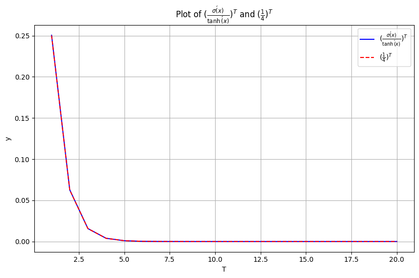

# Question 2

## Q2.1

For both activation functions, linear approximation at $\varepsilon \ll 1$.

**For sigmoid activation $\sigma(x)$**:
- $\sigma(x) = \frac{1}{1+e^{-x}}$
- $\dot{\sigma}(x) = \sigma(x)(1-\sigma(x))$
- At $x = 0$: $\sigma(0) = \frac{1}{2}$
- At $x = 0$: $\dot{\sigma}(0) = \sigma(0)(1-\sigma(0)) = \frac{1}{2} \cdot \frac{1}{2} = \frac{1}{4}$

Using Maclaurin expansion at $\varepsilon \ll 1$:
$\dot{\sigma}(\varepsilon) \approx \dot{\sigma}(0) + \ddot{\sigma}(0)\varepsilon = \frac{1}{4} + \ddot{\sigma}(0)\varepsilon$

Where $\ddot{\sigma}(0) = \frac{d}{dx}[\sigma(x)(1-\sigma(x))]|_{x=0} = \sigma'(0)(1-\sigma(0)) - \sigma(0)\sigma'(0) = \frac{1}{4} - \frac{1}{4} = 0$

Therefore:
$\dot{\sigma}_{\text{approx}}(\varepsilon) = \frac{1}{4}$

**For tanh activation**:
- $\tanh(x)$
- $\frac{d}{dx}\tanh(x) = 1 - \tanh^2(x)$
- At $x = 0$: $\tanh(0) = 0$
- At $x = 0$: $\dot{\tanh}(0) = 1 - \tanh^2(0) = 1 - 0 = 1$

Using Maclaurin expansion at $\varepsilon \ll 1$:
$\dot{\tanh}(\varepsilon) \approx \dot{\tanh}(0) + \ddot{\tanh}(0)\varepsilon = 1 + \ddot{\tanh}(0)\varepsilon$

Where $\ddot{\tanh}(0) = \frac{d}{dx}[1-\tanh^2(x)]|_{x=0} = -2\tanh(x)\dot{\tanh}(x)|_{x=0} = -2 \cdot 0 \cdot 1 = 0$

Therefore, $\dot{\tanh}_{\text{approx}}(\varepsilon) = 1$

## Q2.2

To find the interval for $\varepsilon$ in which $\dot{\sigma}_{\text{approx}}(\varepsilon) \leq \dot{\tanh}_{\text{approx}}(\varepsilon)$:

From Q2.1:
- $\dot{\sigma}_{\text{approx}}(\varepsilon) = \frac{1}{4}$
- $\dot{\tanh}_{\text{approx}}(\varepsilon) = 1$

Since $\frac{1}{4} < 1$ for all values of $\varepsilon$, the condition $\dot{\sigma}_{\text{approx}}(\varepsilon) \leq \dot{\tanh}_{\text{approx}}(\varepsilon)$ is satisfied for all values of $\varepsilon$.

Therefore, the interval is $\varepsilon \in (-\infty, \infty)$.

## Q2.3

Comparing the two curves:
- Both curves drop exponentially as $T$ increases
- The true ratio drops slightly more slowly than the approximative ratio
- But both ratios approach zero very quickly as $T$ increases

## Q2.4

The observation implies that when training an RNN, the vanishing gradient problem occurs with both sigmoid and tanh activations, but it's less severe with tanh.

From the calculations:
- For sigmoid: The derivative has a maximum value of 0.25
- For tanh: The derivative has a maximum value of 1.0

When backpropagating through time in an RNN, gradients are multiplied by these derivatives repeatedly. With each time step we go back, the gradient gets multiplied by:
- At most 0.25 for sigmoid
- At most 1.0 for tanh

After T time steps, the gradient is reduced by approximately:
- $(0.25)^T$ for sigmoid
- $(1.0)^T$ for tanh

This means tanh helps slow down the vanishing gradient problem because its derivative can be closer to 1, allowing gradients to flow back through more time steps before becoming too small. With sigmoid, gradients vanish approximately 4 times faster with each time step.