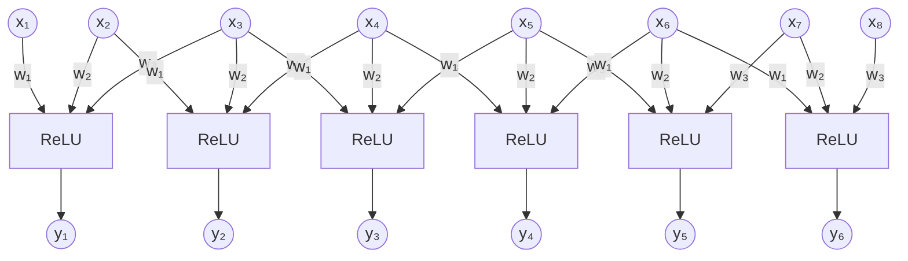

# Question 2: Convolution as Layer of Neurons

## Q2.1

Given parameters:
- Input vector: $\mathbf{x} \in \mathbb{R}^8$
- Kernel: $\mathbf{w} \in \mathbb{R}^3$
- Stride: $S = 1$
- No padding
- Activation: ReLU

The output dimension is:
$\dim(\mathbf{y}) = N - F + 1 = 8 - 3 + 1 = 6$

The neural layer can be represented as follows:

Each output neuron computes:
$$y_i = \text{ReLU}\left(\sum_{j=0}^{F-1} w_{j+1} \cdot x_{i+j}\right) = \text{ReLU}(w_1 x_i + w_2 x_{i+1} + w_3 x_{i+2})$$

for $i = 1, 2, \ldots, 6$.

## Q2.2

The neurons are locally connected because each output neuron only connects to a small, localized subset of input neurons. Specifically, each output connects to exactly $F = 3$ consecutive inputs:

$$y_1 = \text{ReLU}(w_1 x_1 + w_2 x_2 + w_3 x_3)$$
$$y_2 = \text{ReLU}(w_1 x_2 + w_2 x_3 + w_3 x_4)$$
$$y_3 = \text{ReLU}(w_1 x_3 + w_2 x_4 + w_3 x_5)$$
$$y_4 = \text{ReLU}(w_1 x_4 + w_2 x_5 + w_3 x_6)$$
$$y_5 = \text{ReLU}(w_1 x_5 + w_2 x_6 + w_3 x_7)$$
$$y_6 = \text{ReLU}(w_1 x_6 + w_2 x_7 + w_3 x_8)$$

1. Each output $y_i$ depends only on a fixed-size window of inputs ($F=3$ in this case)
2. The connection pattern shifts by the stride value ($S=1$) for each subsequent output
3. No output connects to all inputs in the array

Localized connection pattern allows the network to identify local patterns at different positions in the input.

## Q2.3

A fully-connected layer mapping from $\mathbb{R}^8$ to $\mathbb{R}^6$ require:

1. **Weights**: Each output neuron connects to all input neurons, creating an $8 \times 6$ weight matrix:
   $\text{Number of weights} = N \times (N-F+1) = 8 \times 6 = 48$

2. **Biases**: Each output neuron has its own bias:
   $\text{Number of biases} = (N-F+1) = 6$

Therefore, the total number of learnable parameters is:
$\text{Total parameters} = 48 + 6 = 54$

The fully-connected layer would be:
$$y_i = \text{ReLU}\left(\sum_{j=1}^{8} w_{ij}x_j + b_i\right)$$

for $i = 1, 2, \ldots, 6$, where each weight $w_{ij}$ is a unique parameter.

## Q2.4

In the problem:
1. **Weights**: $F = 3$ (the kernel size)
2. **Bias**: 1 (shared across all applications of the kernel)
3. **Total parameters**: $F + 1 = 3 + 1 = 4$

Comparison:
- Fully-connected layer: 54 parameters
- Convolutional layer: 4 parameters
- Much less parameters in convolutional layer

The parameter efficiency of convolutional layers comes from:
1. **Weight sharing**: The same kernel weights are reused across different positions in the input
2. **Local connectivity**: Each output connects to only $F$ inputs rather than all $N$ inputs

which means for architectures like VGG-16:

1. **Parameter efficiency**: VGG-16 consists of multiple convolutional layers with large input dimensions. If these were replaced with fully-connected layers, the number of parameters would increase like crazy.

2. **Computational availability**: The parameter sharing and local connectivity make deep architectures like VGG-16 computationally available. Without these properties, training such deep networks would be impractical due to memory constraints and computational requirements.

3. **Reduced overfitting**: Fewer parameters means less risk of overfitting, allowing deep convolutional architectures to generalize better from limited training data.

4. **Spatial hierarchy**: The local connectivity and parameter sharing in convolutional layers enable VGG-16 to learn hierarchical features regardless of their position in the input, making them naturally suited for visual pattern recognition tasks.