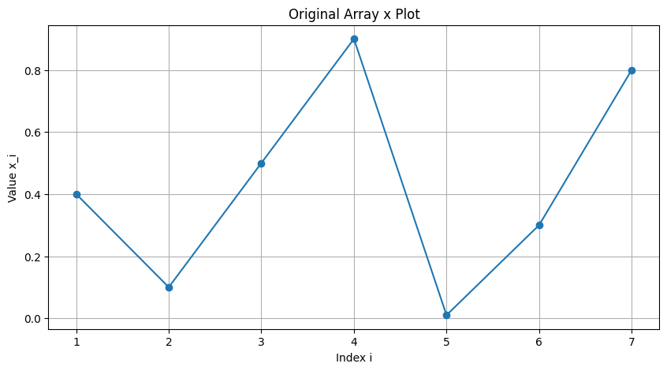

# Question 3: Reducing Jitter via Max-Pooling

## Q3.1

The original array $\mathbf{x} = [0.4, 0.1, 0.5, 0.9, 0.01, 0.3, 0.8]$ can be plotted against its indices $(i, x_i)$ for $i = 1, \ldots, 7$:

## Q3.2

Applying max-pooling with filter length $F = 2$ while maintaining the original dimension requires:

1. Add zero padding at the end: $\mathbf{x}_{\text{padded}} = [0.4, 0.1, 0.5, 0.9, 0.01, 0.3, 0.8, 0]$
2. Apply max-pooling with $F = 2$

The max-pooling operation gives:

$$y_i = \max\{x_i, x_{i+1}\}$$

Computing for each position:

$$y_1 = \max\{x_1, x_2\} = \max\{0.4, 0.1\} = 0.4$$
$$y_2 = \max\{x_2, x_3\} = \max\{0.1, 0.5\} = 0.5$$
$$y_3 = \max\{x_3, x_4\} = \max\{0.5, 0.9\} = 0.9$$
$$y_4 = \max\{x_4, x_5\} = \max\{0.9, 0.01\} = 0.9$$
$$y_5 = \max\{x_5, x_6\} = \max\{0.01, 0.3\} = 0.3$$
$$y_6 = \max\{x_6, x_7\} = \max\{0.3, 0.8\} = 0.8$$
$$y_7 = \max\{x_7, x_8\} = \max\{0.8, 0\} = 0.8$$

Therefore, the max-pooled array is:

$$\mathbf{y} = [0.4, 0.5, 0.9, 0.9, 0.3, 0.8, 0.8]$$

## Q3.3/Q3.4

Max-pooled array (F = 2): [0.4 0.5 0.9 0.9 0.3 0.8 0.8]
Max-pooled array (F = 3): [0.5 0.9 0.9 0.9 0.8 0.8 0.8]
Max-pooled array (F = 7): [0.9 0.9 0.9 0.9 0.8 0.8 0.8]

Comparing the plots:
- The max-pooling operation preserves local maxima (peaks)
- It eliminates local minima when they're followed by higher values
- It creates plateaus where the same maximum value spans consecutive indices (e.g., at indices 3-4 and 6-7)
- The overall pattern is smoother than the original array

## Q3.5

1. **Increasing Smoothness**: As the filter length increases, the output becomes progressively smoother:
   - With $F=2$, some local variations remain
   - With $F=3$, fewer distinct values appear
   - With $F=7$, the array is reduced to just two distinct values (0.9 and 0.8)

2. **Preserving Dominant Features**: Max-pooling effectively captures and preserves the dominant features (highest values) within each window, while eliminating smaller variations.

3. **Jitter Reduction**: The "jitter" or rapid fluctuations in the original signal are progressively reduced as the filter size increases, creating smoother transitions and plateaus.

4. **Information Compression**: As $F$ increases, the array retains less detail but maintains the most important information (location of maximal values).

5. **Translation Invariance**: Max-pooling provides a form of local translation invariance - the exact position of a peak within a window becomes less important as the window size increases.